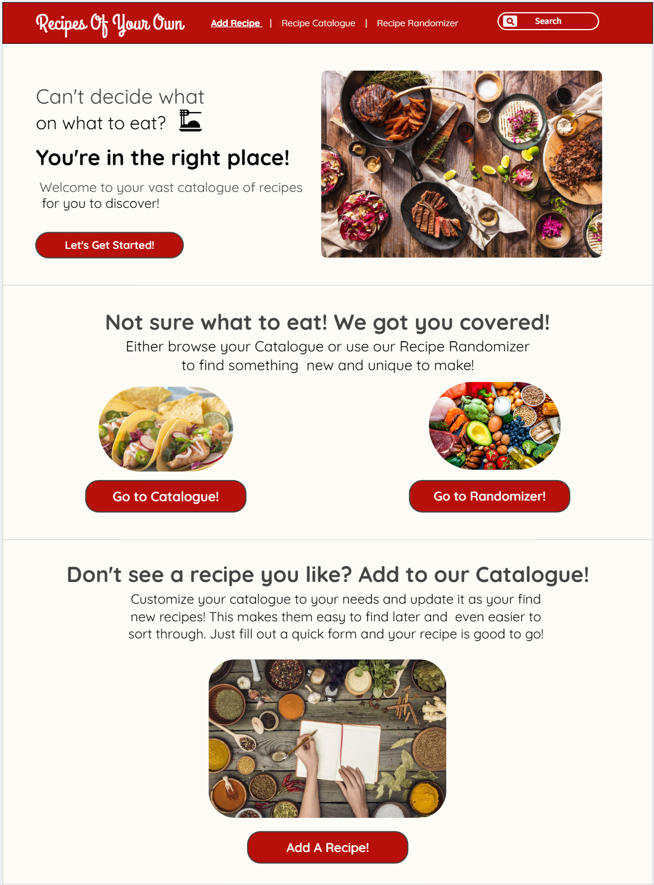
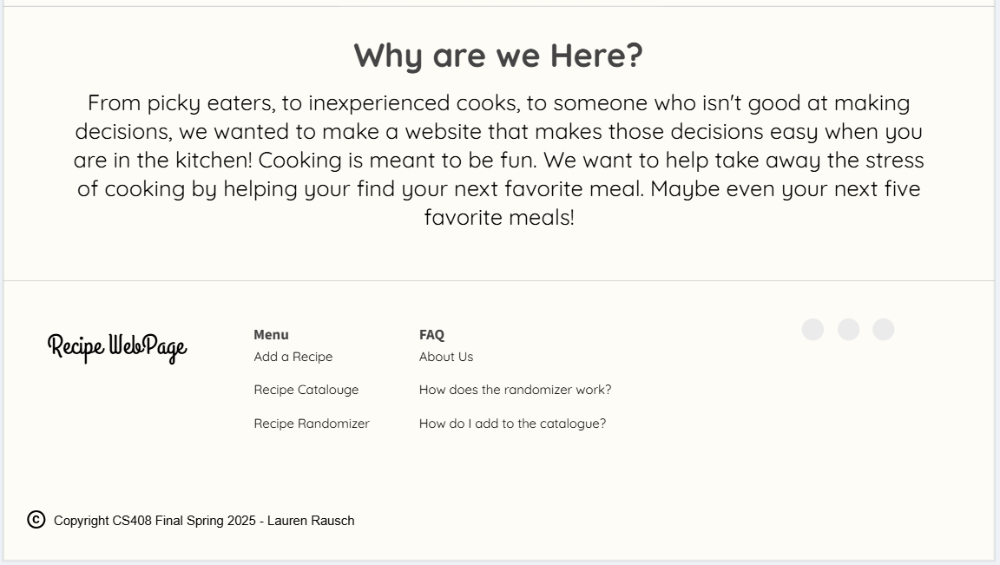
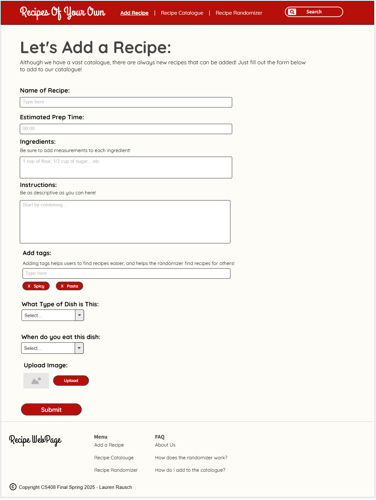
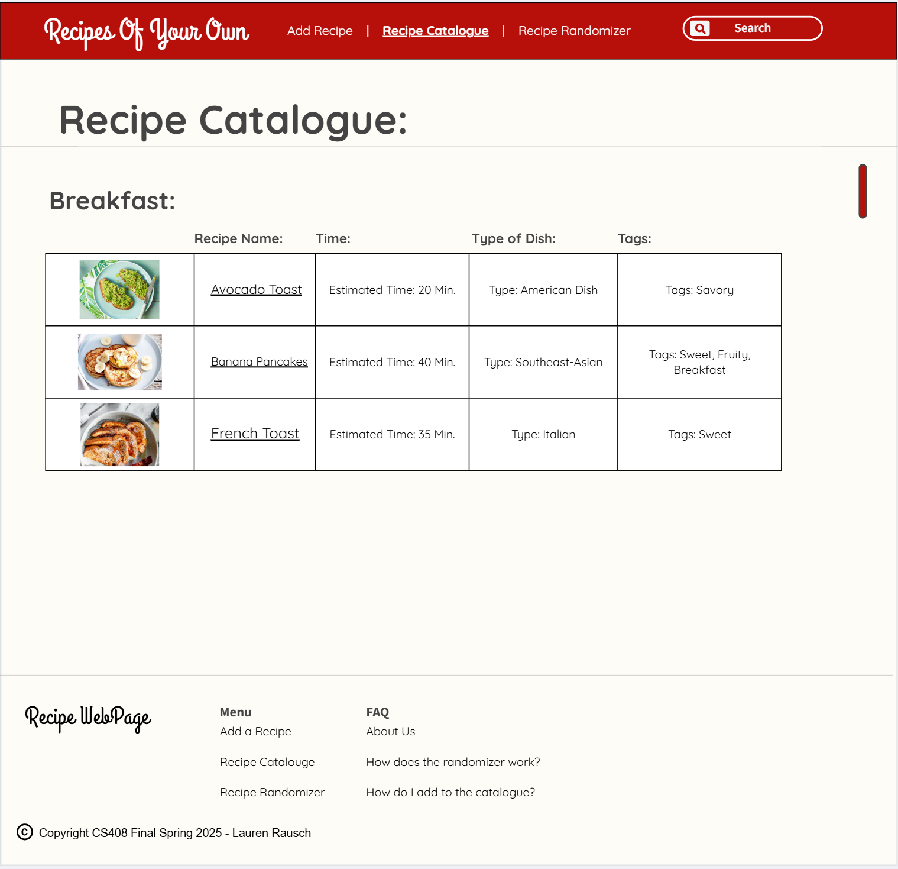
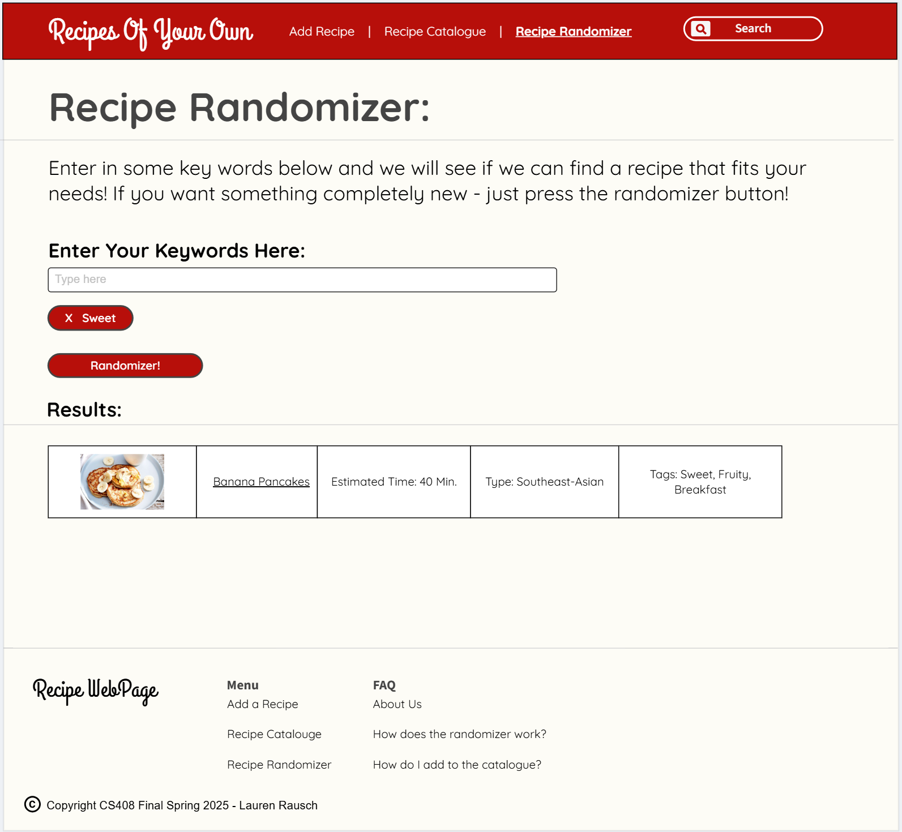

# CS 408 Final Project: Recipes of Your Own

## Project Specifications

This project concept was actually incredibly difficult to decide because at first I thought, well everything that I could think of has already been done. I ultimately ended up deciding to make a personal cookbook/catalogue. This page will be able to hold and search through recipes you enter based on specific guidelines. This idea originally started with being able to get a random recipe recommended to a user, then evolved into recommending recipes based on some user inputs, like sorting by specific tags. Then I decided what if I make a website that has a catalogue of recipes that users can scroll through but also recommend recipes based on simple tags, or just get random recipes in general from their inputs.

The randomization of the recipes will follow a few different guides, the users can put in ingredients they have available and get a recipe. The users can put in a certain style of cuisine they desire and get randomized recipes based on the tags they select. For example, they could select Italian and spicy and get a recipe that has those tag markers. The user can also select to not put any tags and just get a randomly generated recipe. 

The rest of the webpage will have the full catalogue that the users can browse through that can be listened to from A-Z and by time of day. For example, breakfast, appetizers, lunch, dinner.. There will also be a section where users can add recipes to the webpage. there will be a fill in template that the users can fill out to be able to upload to the recipe catalogue, and add the appropriate tags in order for it to be sorted accurately. This makes it easier for the users to find their recipes when sorting or randomizing through them.
 
### A few other questions to address: 

#### What is the general theme? 
The general theme is to be a personalized cookbook, making images and quick information easy to make choices.. A place where people who are picky or have a hard time deciding what to make or have a hard time picking meals can go and get an easy answer.

#### What is it going to do? 
Help users discover new recipes or help users to be able to find meals that are fitting their needs. Opening up people to be able try new foods and expand their culinary knowledge.

#### Who is the target audience?
This is more of a website made for adults. The age range from 20-60. Probably for a general population and not necessarily for people who are very experienced with cooking. It will be easy for an adult audience with any webpages to be able to navigate.

#### What sort of data will it manage? 
The type of data that will be managed will be input data created by users. It will manage images (connected to the recipes), and input data that gives the explanation for the recipe. 

#### Stretch Goals?
I think once I meet most if not all of the goals I have suggested above, I would potentially like to add a comment system or maybe even a rating system and expand it to a multi user base. It would make it so users can vote on recipes and recommend ones they like to other users. As well as leave comments on recipes that they liked and maybe add extra tips for other people trying the recipe. Maybe as a very long long term goal, maybe add some functionality to be able to make it so users can have profiles and be able to log in and save recipes to their profiles. I unfortunately don’t have much experience with that type of thing so that would be something to add maybe outside of this class I could add.

## Project Wireframe

### Home Page

### Add A Recipe 

### Recipe Catalogue

### Recipe Randomizer

#### Outside Sources 

https://stackoverflow.com/questions/3308365/css-no-text-wrap
https://www.w3schools.com/howto/howto_css_searchbar.asp
https://developer.mozilla.org/en-US/docs/Web/HTML/Reference/Elements/select
https://developer.mozilla.org/en-US/docs/Web/HTML/Reference/Elements/input/file
https://www.w3schools.com/tags/tag_textarea.asp
https://stackoverflow.com/questions/3896537/should-i-size-a-textarea-with-css-width-height-or-html-cols-rows-attributes
